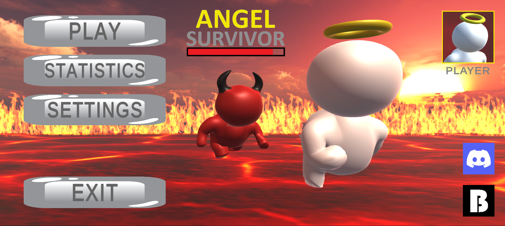
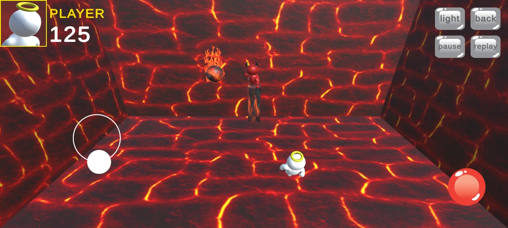
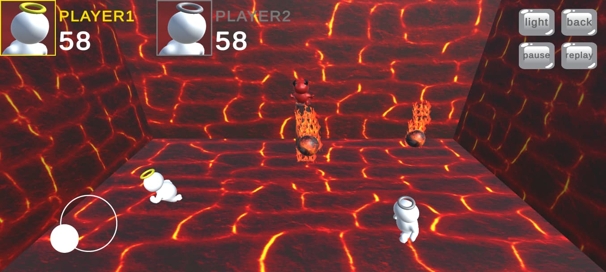

<h1 align="center">Angel Survivor</h1>

<p align="center">
A 3D mobile survival game developed with Unity and C#.<br>
Control an angel trapped in the devil's prison, dodge falling meteors, and survive as long as possible.
</p>

<p align="center">
  
  
  
  
  
  
  
  
  
</p>

---

## Project Overview

**Angel Survivor** is a 3D isometric survival game where an angel tries to stay alive inside a dangerous arena controlled by the devil.

The core loop is simple:

- meteors fall randomly into the arena,
- the player moves with a mobile joystick,
- the roll action helps dodge incoming hazards,
- the arena becomes more dangerous over time,
- the match ends when the angel is hit or eliminated by arena hazards.

The game includes both a single-player survival mode and a local two-player mode where two angels share the same device and compete to survive longer.



---

## Supported Platform

Angel Survivor is organized as a Unity Android project.

- **Android Version** - touch-based controls with on-screen joysticks and action buttons.

Compiled Android builds are not stored in the source repository. Release builds should be distributed through GitHub Releases, itch.io, Google Play, or another download page.

---

## Project Structure

```text
Angel_Survivor/
|-- Assets/
|   |-- animations/
|   |-- codes/
|   |   |-- angel1Pcontrol.cs
|   |   |-- angel2Pcontrol.cs
|   |   |-- buttons.cs
|   |   |-- planefireball.cs
|   |   |-- musiccode.cs
|   |   |-- soundcode.cs
|   |   |-- recordtime.cs
|   |   |-- totaldeaths.cs
|   |   `-- totalgame.cs
|   |-- items/
|   |   |-- flags/
|   |   |-- drawimages/
|   |   `-- Materials/
|   |-- man/
|   |-- Material/
|   |   |-- Free HDR Skyboxes Pack/
|   |   |-- JellyIcons/
|   |   |-- Joystick Pack/
|   |   |-- Texture/
|   |   `-- sky/
|   |-- musics/
|   |-- screenshots/
|   |   |-- angelmenu.png
|   |   |-- single-player.png
|   |   `-- two-player.png
|   |-- Scenes/
|   |   |-- angelsurvivor.unity
|   |   |-- babagame.unity
|   |   |-- menu.unity
|   |   |-- 1Por2Pscene.unity
|   |   |-- 1Pgame.unity
|   |   |-- 2Pgame.unity
|   |   |-- statistics.unity
|   |   |-- settings.unity
|   |   `-- fromfurkan.unity
|   `-- TextMesh Pro/
|-- Packages/
|-- ProjectSettings/
|-- .gitattributes
|-- .gitignore
|-- .vsconfig
|-- LICENSE
`-- README.md
```

---

## Core Systems

### Player Movement

- Touch joystick movement for Android.
- Rigidbody-based movement and rotation.
- Animator-driven idle, run, roll, and death states.
- Roll action with sound feedback.

### Meteor System

- Fireballs spawn at random positions above the arena.
- Meteors respawn after hitting the ground.
- The match starts with fewer active hazards and increases pressure over time.
- Up to 14 meteor objects can participate in the survival loop.

### Arena Hazard Progression

- The arena becomes more restrictive as survival time increases.
- Boundary hazards can eliminate players after the match has progressed.
- Additional fire particle systems activate during longer survival runs.

### Single-Player Flow

- Tracks current survival time.
- Stores best survival time with `PlayerPrefs`.
- Stores total death count and total game count.
- Shows an end panel after death.

### Two-Player Flow

- Two angels play in the same arena.
- Each player has a separate joystick and roll button.
- If one angel dies, the remaining player continues.
- The result panel displays the surviving player or a draw state.

### Menu, Settings, and Statistics

- Main menu with play, statistics, settings, credits, and exit actions.
- Mode selection for 1 player or 2 players.
- Statistics screen for record time, total games, and total deaths.
- Settings screen for music, sound effects, and language.
- Multi-language UI support for Turkish, English, French, German, Russian, Italian, Spanish, and Portuguese.

---

## Features

### Survival Gameplay

- Fast reaction-based survival loop.
- Random meteor positions keep each run unpredictable.
- Increasing pressure over time encourages longer and more challenging runs.

### Local Two-Player Mode

- Designed for two players on the same Android device.
- Player 1 and Player 2 use separate on-screen control areas.
- The game continues until both angels are eliminated or a winner is determined.

### Mobile-Friendly Controls

- Floating joystick input.
- On-screen roll buttons.
- Pause, replay, back, and light toggle buttons inside gameplay scenes.

### Persistent Statistics

- Record survival time.
- Total game count.
- Total death count.
- Stored locally through Unity `PlayerPrefs`.

---

## Game Mechanics

### Meteor Spawning

Meteors are spawned at randomized X/Z positions and dropped from above the arena. After a meteor collides with the ground, it is repositioned and activated again.

### Hazard Scaling

Additional meteors are introduced as the run continues. This gradually increases the difficulty and forces the player to keep moving.

### Rolling

The roll button triggers the angel's roll animation and roll sound effect. It is designed as the player's main evasive action during close meteor patterns.

### Losing

In single-player mode, the game ends when the angel collides with a meteor or enters a dangerous arena area after the hazard phase begins.

In two-player mode, one player can be eliminated while the other keeps playing. The game ends when the final result can be shown.

---

## How to Play

1. Start the game from the main menu.
2. Select 1 player or 2 players.
3. Move the angel with the on-screen joystick.
4. Use the roll button to dodge dangerous meteor patterns.
5. Stay inside the safe part of the arena.
6. Survive as long as possible.

---

## Controls

### Android

| Action | Control |
|---|---|
| Move | Floating joystick |
| Roll | On-screen roll button |
| Pause / Resume | Pause button |
| Restart | Replay button |
| Return to menu | Back button |
| Toggle light | Light button |

### Two-Player Mode

| Player | Control Area |
|---|---|
| Player 1 | Left-side joystick and roll control |
| Player 2 | Right-side joystick and roll control |

---

## Screenshots

### Single Player



### Two Player



---

## Technologies Used

- **Unity Engine 2022.3.7f1** - game development engine.
- **C#** - gameplay, UI, settings, statistics, and scene flow logic.
- **TextMeshPro** - UI text rendering.
- **Unity UI (UGUI)** - menus, buttons, settings, and on-screen controls.
- **Unity Physics** - Rigidbody movement, collisions, and arena interaction.
- **Unity Animator** - character movement, roll, death, and menu animations.
- **Blender** - custom angel and devil model work.

---

## Assets and Audio

### Visual Assets

- Angel and devil character models: created by **A. Furkan Ocel**.
- HDR skyboxes: Free HDR Skyboxes Pack.
- UI icons: Jelly Icons.
- Mobile joystick controls: Joystick Pack.
- Meteor, wall, floor, lava, and arena textures are included in the Unity project.

Asset sources:

https://assetstore.unity.com/packages/2d/textures-materials/sky/free-hdr-skyboxes-pack-175525

https://assetstore.unity.com/packages/2d/gui/icons/jelly-icons-99749

https://pikbest.com/backgrounds/volcanic-abstract-rock-texture-a-3d-rendered-cooled-lava-background_9622899.html

https://www.textures4photoshop.com/tex/stone-and-rock/lava-texture-seamless-for-games.aspx

### Audio

- Sound effects: RPG Essentials Sound Effects Free.
- Game music is included in the Unity project.

Audio sources:

https://assetstore.unity.com/packages/audio/sound-fx/rpg-essentials-sound-effects-free-227708

https://www.youtube.com/watch?v=E5YRrEoxR7Y

---

## Localization

Angel Survivor includes language support for:

- Turkish
- English
- French
- German
- Russian
- Italian
- Spanish
- Portuguese

All translations were prepared by **A. Furkan Ocel**.

---

## Installation and Play

1. Clone the repository:

```bash
git clone https://github.com/AFurkanOcel/Angel_Survivor.git
```

2. Open the project folder with Unity Hub:

```text
Angel_Survivor
```

3. Use **Unity 2022.3.7f1** or a compatible Unity 2022.3 LTS version.

4. Open the main menu scene:

```text
Assets/Scenes/menu.unity
```

5. Press **Play** in the Unity Editor.

### Builds

Compiled Android builds are not stored in this source repository. Build outputs such as `.apk` and `.aab` files should be distributed separately through GitHub Releases, itch.io, Google Play, or another download platform.

---

## Repository Notes

This repository stores the Unity source project only.

Generated Unity and IDE files are intentionally ignored:

- `Library/`
- `Temp/`
- `Obj/`
- `Build/`
- `Builds/`
- `Logs/`
- `UserSettings/`
- `.vs/`
- `.csproj`
- `.sln`
- Android build outputs

---

## Credits

### Game Development

**A. Furkan Ocel**

GitHub: https://github.com/AFurkanOcel

### Voice Acting

- Angel voice: **A. Furkan ÖCEL**

---

## License

This project is licensed under the terms included in the repository's `LICENSE` file.
